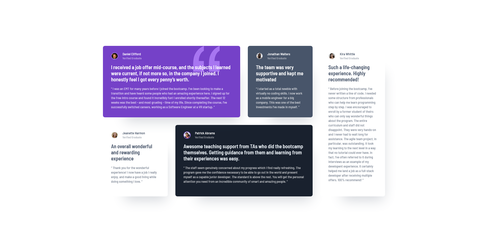

# Frontend Mentor - Testimonials grid section solution

This is a solution to the [Testimonials grid section challenge on Frontend Mentor](https://www.frontendmentor.io/challenges/testimonials-grid-section-Nnw6J7Un7). Frontend Mentor challenges help you improve your coding skills by building realistic projects. 

## Table of contents

- [Overview](#overview)
  - [The challenge](#the-challenge)
  - [Screenshot](#screenshot)
  - [Links](#links)
- [My process](#my-process)
  - [Built with](#built-with)
  - [What I learned](#what-i-learned)
  - [Continued development](#continued-development)
  - [Useful resources](#useful-resources)
- [Author](#author)

## Overview

This project aims to help developers learn CSS grid and layouting in general. By building this project, developers will be able to learn CSS grid through hands on practice.

### The challenge

Users should be able to:

- View the optimal layout for the site depending on their device's screen size

Code requirements for myself:

- Use CSS Grid
- Use Sass features

### Screenshot



### Links

- Solution URL: [https://www.frontendmentor.io/solutions/responsive-testimonials-grid-section-using-css-grid-and-sass-mixins-3wv6-XpV0F](https://www.frontendmentor.io/solutions/responsive-testimonials-grid-section-using-css-grid-and-sass-mixins-3wv6-XpV0F)
- Live Site URL: [https://schindlerdumagat.github.io/testimonials-grid-section/](https://schindlerdumagat.github.io/testimonials-grid-section/)

## My process

Before starting the project, I read articles about CSS layouts, flexbox and grid. I also planned to create a reusable testimonials card CSS styles and found out that Sass provides some tools to help me with that such as mixins so I read more about it. After reading some articles, I applied the things I learned and implement it effectively to this project.

### Built with

- Semantic HTML5 markup
- CSS custom properties
- Flexbox
- CSS Grid
- Mobile-first workflow
- [Sass](https://sass-lang.com/) - CSS preprocessor

### What I learned

```CSS Grid
main {
    height: 90%;
    width: 90%;
    display: grid;
    grid-template-columns: 1fr;
    justify-content: center;
    gap: 24px;

    @media screen and (min-width: 64rem) {
        height: unset;
        grid-template-columns: repeat(4, fit-content(15.938rem));
        grid-template-rows: repeat(2, 1fr);
        gap: 30px;
    }
}
```

In this project, I was able to implement CSS grid layout templates and I made it responsive across differenct screen sizes.

```Sass Mixin
@use 'base';

@mixin card(
    $bgColor: white,
    $avatar-border-color: white,
    $name-color: white,
    $status-color: white,
    $title-color: white,
    $review-color: white
    ) {
    background-color: $bgColor;
    border-radius: 8px;
    box-shadow: 40px 60px 50px -47px rgba(base.$font-color-dark-grayish-blue, 24.74%);
    padding: 26px 32px 32px;

    .author-details {
        display: flex;
        align-items: center;
        gap: 17px;
        height: 1.75rem;
        margin-bottom: 18px;
        position: relative;

        img {
            border-radius: 50%;
            border: 2px solid $avatar-border-color;
            height: 100%;
        }

        .name {
            color: $name-color;
            font-weight: base.$font-weight-medium;
            line-height: 1;
            margin-bottom: 4px;
        }
    
        .status {
            color: rgba($status-color, base.$status-opacity);
            font-size: 0.688rem;
            font-weight: base.$font-weight-medium;
            line-height: 1;
        }
    }

    h1 {
        color: $title-color;
        font-size: 1.25rem;
        font-weight: base.$font-weight-semibold;
        margin-bottom: 1rem;
        position: relative;
    }

    blockquote {
        font-size: base.$font-weight-medium;
        line-height: 18px;
        color: rgba($review-color, base.$review-opacity);
    }
}
```

I also used the mixin feature of Sass in order to create a reusable card CSS styles. I just wrote it once I reuse it for each testimonials card.
I also used Sass partials feature to separate my base styles, card mixin styles and main styles into separate files.

### Continued development

I plan to master CSS grid and use it effectively to my future projects. I also want to dive deeper in Sass and utilize its features to its maximum.

### Useful resources

- [Web.Dev Grid](https://web.dev/learn/css/grid?continue=https%3A%2F%2Fweb.dev%2Flearn%2Fcss%2F%23article-https%3A%2F%2Fweb.dev%2Flearn%2Fcss%2Fgrid) - This gave me an overview of CSS grid and its basics. There are more to CSS grid but this resource can you get started with building layouts with CSS grid.
- [Sass Basics](https://sass-lang.com/guide/) - This helped me create a reusable CSS styles that I can use everywhere. Sass has a feature to implement that and that is called mixins. You just have to write your CSS styles once and use it everywhere. They also have other neat features such as partials which you can use to separate related styles into files.

## Author

- Website - [Schindler Dumagat](https://schindlerdumagat.github.io/webportfolio/)
- Frontend Mentor - [@schindlerdumagat](https://www.frontendmentor.io/profile/schindlerdumagat)
- LinkedIn - [schindlerdumagat](https://www.linkedin.com/in/schindler-dumagat-015238230/)
